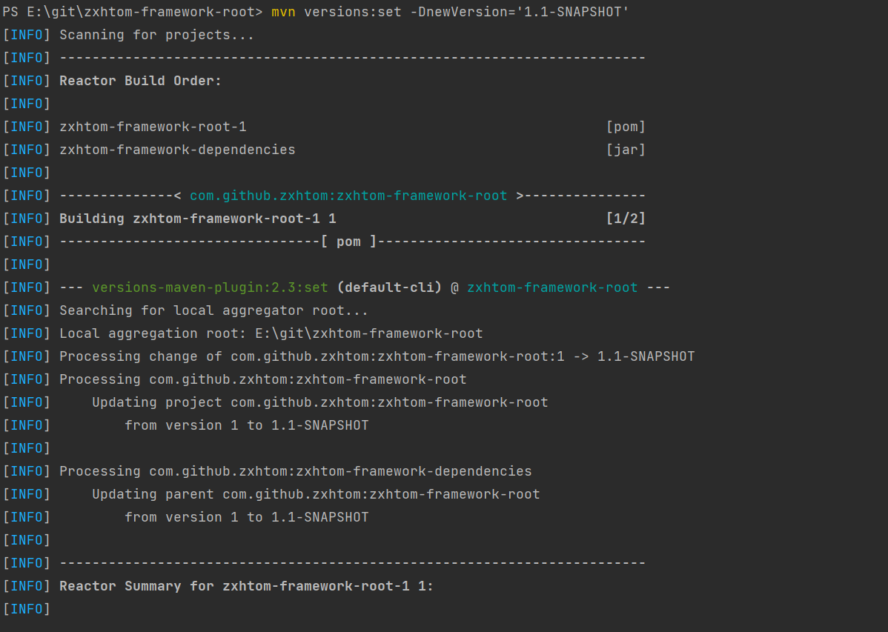
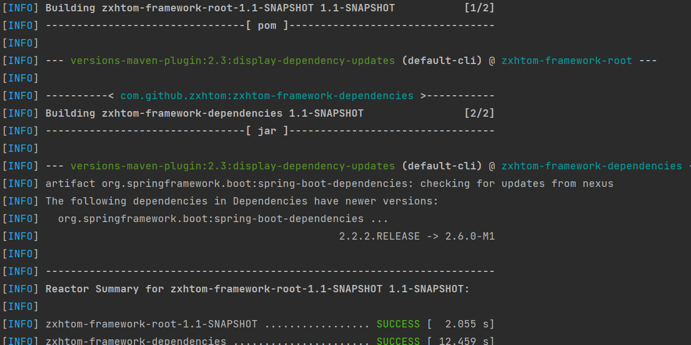

# 作用

  - 管理项目初始化，该模块不做依赖处理，仅仅处理插件和仓库设置

# versions-maven-plugin

  - 方便管理同意脚手架版本。
  - 当整体版本需要升级的时候，之前我们都是采用人工修改版本的方式，而通过versions-maven-plugin就可以轻松管理整体版本
  

  - 如上图我们只需要执行`mvn versions:set -DnewVersion='1.1-SNAPSHOT'` 就可以轻松实现所有模块的修改包括所依赖的父项目版本

## mvn versions:set -DnewVersion='1.1-SNAPSHOT'

  - 修改统一版本

## mvn versions:display-dependency-updates

  - 查看那些者依赖有更新版本

# mvn versions:display-plugin-updates

  - 查看那些插件有更新版本

# mvn versions:use-latest-versions

  - 将所有的依赖自动升级到最新版本(慎用)

# mvn versions:commit

  - 升级后如果满意我们就可以提交了

# mvn versions:revert

  - use-lastest-versions后不满意我们可以回退

# 规范约定

  - 数据库sql编写不允许使用特用函数(方便后期适配多种数据库)
  - 不允许出现硬编码(方便动态配置，所有硬编码数据全部放在数据字典表中)
  - 
